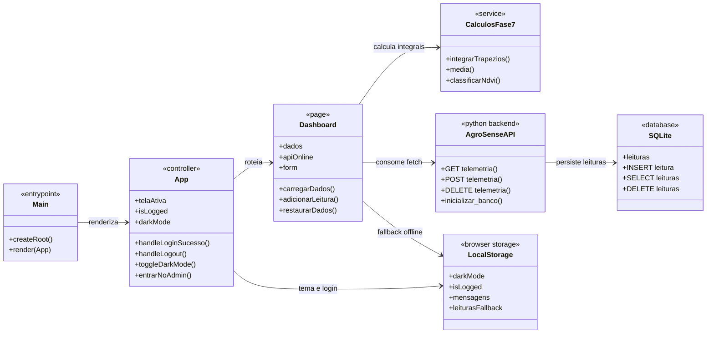
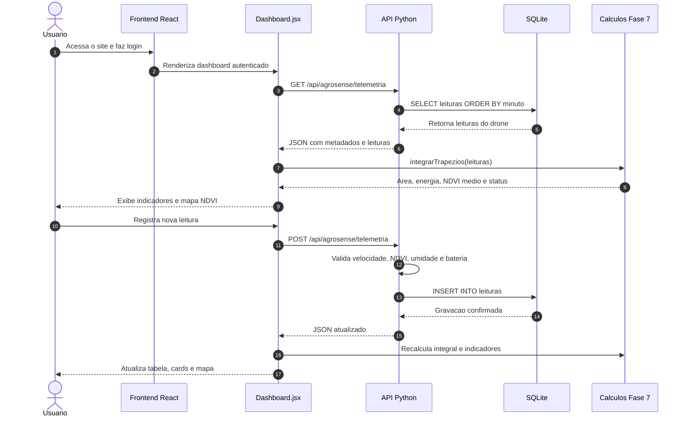

# Diagramas UML - AgroSense Fase 7

Este documento descreve os principais diagramas do projeto AgroSense na Fase 7. A entrega considera o front-end em React, a API em Python, o banco SQLite e os calculos matematicos com integrais.

## 1. Diagrama de classes e componentes

Arquivo Mermaid: `docs/uml/agrosense-component-uml.mmd`

O diagrama de classes representa os componentes principais da aplicacao e suas responsabilidades:

- `App`: controla a tela ativa, login, logout e modo escuro.
- `Header` e `MenuPerfil`: permitem navegacao, troca de tema e saida do usuario.
- `Login`: valida o acesso local com usuario e senha.
- `Dashboard`: tela principal da Fase 7, responsavel por buscar leituras, registrar novos dados e mostrar indicadores.
- `CalculosFase7`: agrupa as funcoes de calculo, incluindo o metodo dos trapezios.
- `AgroSenseAPI`: backend em Python que expoe os endpoints da telemetria.
- `SQLite`: banco de dados usado para persistir as leituras do drone.
- `Contato` e `AdminPanel`: fluxo de mensagens do usuario, com armazenamento local.
- `Sobre`, `Equipe`, `CardsPagina`, `Card` e `TecnologiasAgronegocios`: paginas e componentes institucionais.



## 2. Diagrama de sequencia

Arquivo Mermaid: `docs/uml/agrosense-sequence-fase7.mmd`

O diagrama de sequencia mostra o fluxo principal do dashboard:

1. O usuario faz login.
2. O React renderiza o dashboard.
3. O dashboard chama a API Python.
4. A API consulta o SQLite.
5. O dashboard calcula os indicadores com integrais.
6. O usuario registra uma nova leitura.
7. A API valida e grava a leitura no banco.
8. O dashboard atualiza cards, mapa NDVI e tabela.



## 3. Relacao com os capitulos

- Capitulo 2: eletricidade basica aplicada no calculo `P = V x I` e energia em `Wh`.
- Capitulo 3: diagrama de classes atualizado.
- Capitulo 4: diagrama de sequencia do fluxo de telemetria.
- Capitulo 5: front-end React, CSS e consumo de API com `fetch`.
- Capitulo 6: API Python conectada ao banco SQLite.
- Capitulo 7: calculo de area pelo metodo dos trapezios, aplicando integrais.

## 4. Fluxo de dados

```text
Usuario
  -> React / Dashboard
  -> API Python
  -> SQLite
  -> API Python
  -> Dashboard
  -> Calculos de integrais
  -> Indicadores exibidos na tela
```

## 5. Observacao sobre fallback

Se a API Python nao estiver em execucao, o dashboard usa o arquivo local `public/api/agrosense-fase7.json` e o `localStorage` como modo de demonstracao. Quando a API esta ligada, a persistencia principal acontece no banco `backend/agrosense.db`.
